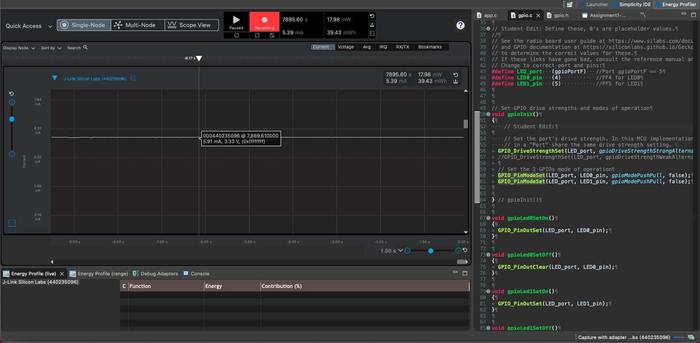
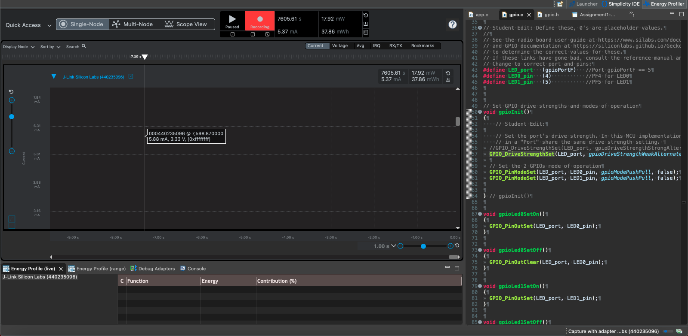
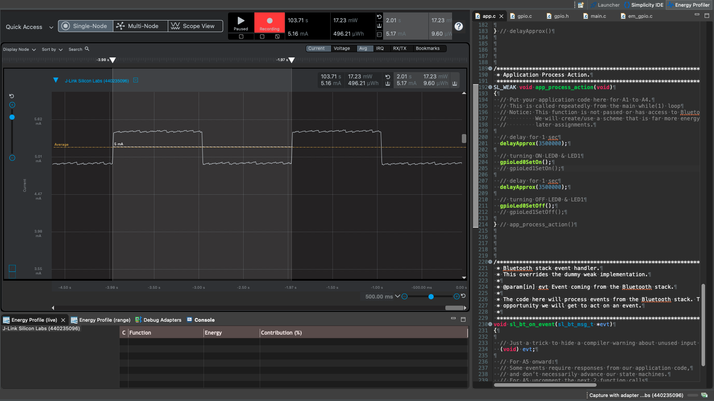
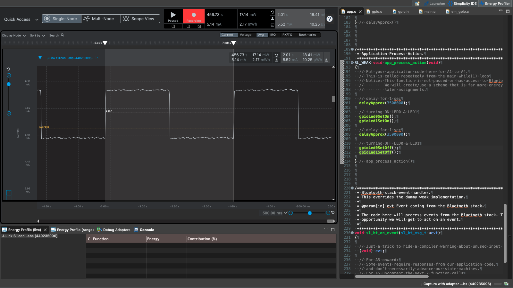

Please include your answers to the questions below with your submission, entering into the space below each question
See [Mastering Markdown](https://guides.github.com/features/mastering-markdown/) for github markdown formatting if desired.

**1. How much current does the system draw (instantaneous measurement) when a single LED is on with the GPIO pin set to StrongAlternateStrong?**  
   Answer:  
   GPIO pin is set to `StrongAlternateStrong` drives **5.91 mA** current. Note, LED0 was set to be ON continuously and not in a blinking pattern. Code was modified to do so. 

   

**2. How much current does the system draw (instantaneous measurement) when a single LED is on with the GPIO pin set to WeakAlternateWeak?**  
   Answer:  
   GPIO pin is set to `WeakAlternateWeak` drives **5.88 mA** current. Note, LED0 was set to be ON continuously and not in a blinking pattern. Code was modified to do so.   
     
   

**3. Is there a meaningful difference in current between the answers for question 1 and 2? Please explain your answer, referencing the main board schematic, WSTK-Main-BRD4001A-A01-schematic.pdf, and AEM Accuracy in the ug279-brd4104a-user-guide.pdf. Both of these PDF files are available in the ECEN 5823 Student Public Folder in Google drive at: https://drive.google.com/drive/folders/1ACI8sUKakgpOLzwsGZkns3CQtc7r35bB?usp=sharing . Extra credit is available for this question and depends on your answer.**  
   Answer:    

* The measured currents for `StrongAlternateStrong` and `WeakAlternateWeak` modes are **5.91 mA** and **5.88 mA**, respectively. The difference between these values is only **0.03 mA**. Given that the Advanced Energy Monitoring (AEM) system has an accuracy tolerance of **0.1 mA** for currents above **250 μA**, as outlined in the [ug279-brd4104a-user-guide.pdf](https://drive.google.com/drive/folders/1ACI8sUKakgpOLzwsGZkns3CQtc7r35bB), this measured difference falls within the equipment's margin of error, making it statistically insignificant.

* However, for a deeper understanding of what these drive strength settings actually mean, we can refer to Silicon Labs' documentation. According to **Section 4.4 "Drive Mode and Drive Strength"** in the [AN0012: General Purpose Input Output Configuration](https://www.silabs.com/documents/public/application-notes/an0012-efm32-gpio.pdf) document, as well as the [WSTK-Main-BRD4001A-A01-schematic.pdf](https://drive.google.com/drive/folders/1ACI8sUKakgpOLzwsGZkns3CQtc7r35bB), drive strength is configurable via specific registers like `GPIO_Px_CTRL`. This could impact the current drive capabilities of the GPIO pins. The document emphasizes the importance of ensuring that the total maximum drive current across all output pins does not exceed the device's specified maximum.

* This suggests that although the difference in current for a single LED may seem negligible, the overall current draw across multiple pins could be significant, particularly in more complex configurations or scenarios where fine control over power consumption is crucial.

* In summary, based on the available documentation and measurement capabilities, **the difference in current between `StrongAlternateStrong` and `WeakAlternateWeak` appears to be negligible for a single LED but could be more relevant in different operational contexts**.

**4. With the WeakAlternateWeak drive strength setting, what is the average current for 1 complete on-off cycle for 1 LED with an on-off duty cycle of 50% (approximately 1 sec on, 1 sec off)?**  
   Answer:  
   Average measurement when a single LED is on and off with the GPIO pin strength set to `WeakAlternateWeak` :  
   - Average current for selected range when only LED0 is ON and OFF for 1 sec on and 1 sec OFF duty cycle - **5.17 mA** 
   
   

**5. With the WeakAlternateWeak drive strength setting, what is the average current for 1 complete on-off cycle for 2 LEDs (both on at the time same and both off at the same time) with an on-off duty cycle of 50% (approximately 1 sec on, 1 sec off)?**  
   Answer:  
   Average measurement when a both LED's are on and off with the GPIO pins strength set to `WeakAlternateWeak` :  
   - Average current for selected range when both LED0&1 are ON and OFF for 1 sec on and 1 sec OFF duty cycle - **5.52 mA** 

   